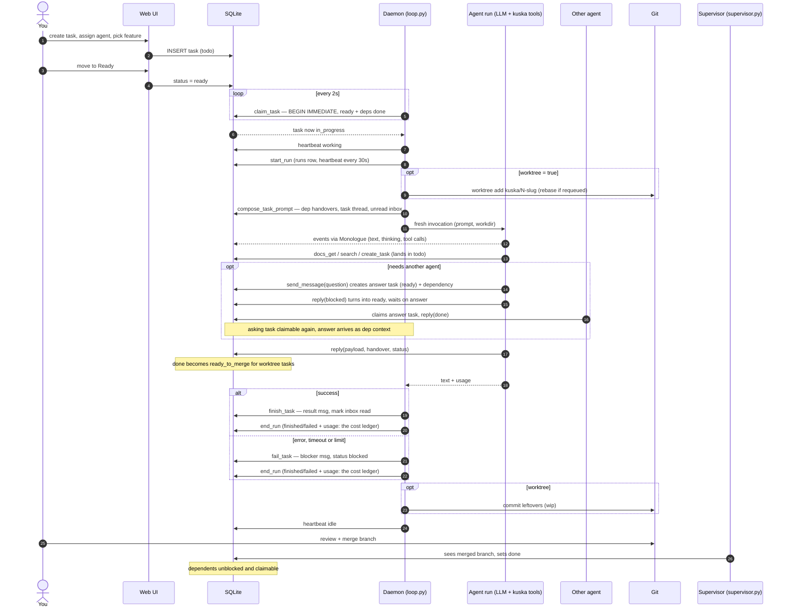
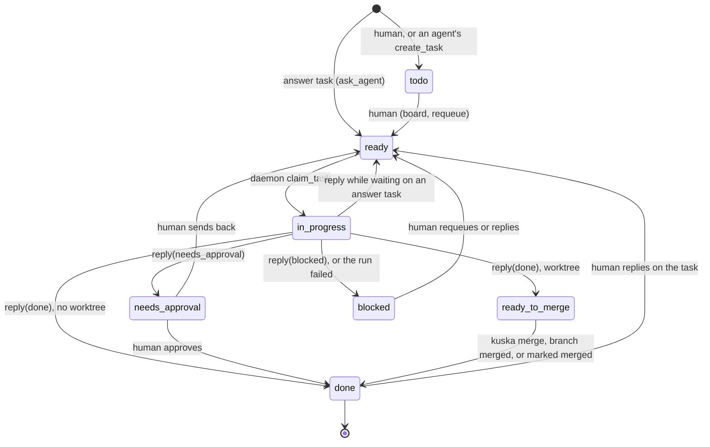
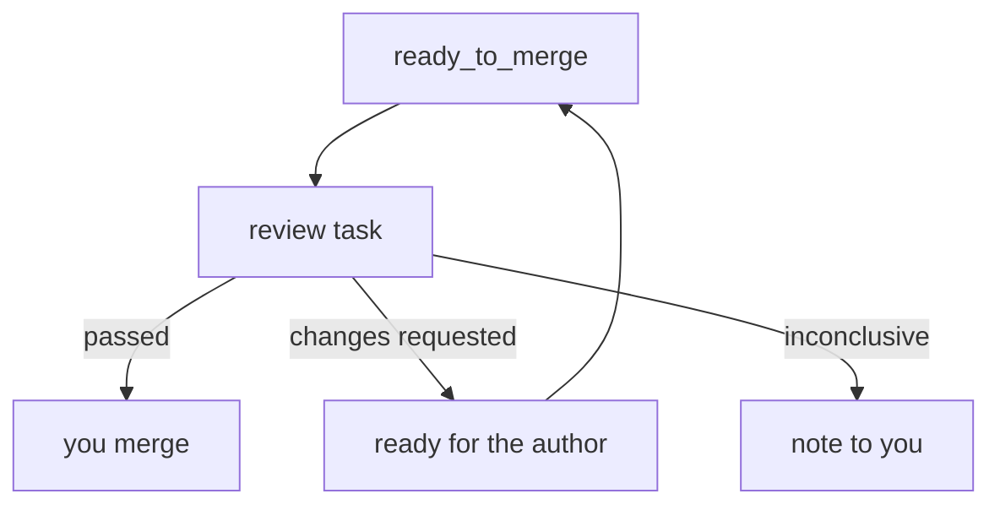

# Agents, tasks and messages

How work moves through kuska: a human queues a task, an agent's daemon claims
it and runs one fresh invocation, and the result comes back as a message and
a status change. Agents never wait on each other inline; a question becomes a
task of its own.

## One task, end to end

## Crash recovery

A daemon that dies mid-run stops heartbeating its `runs` row. The supervisor
(a thread of `kuska serve` and `kuska run-all`, or `kuska supervise`) ends any
run silent for 300 s as `abandoned`, sends the human a `blocker` message and
blocks the task if it is still `in_progress`. It also sets the agent offline.
The same sweep moves `ready_to_merge` tasks whose branch is merged to `done`.
A branch counts as merged when its commits are in the base branch, or when a
commit on base since the task started carries the `Kuska-Task: <id>` trailer
that `kuska merge` writes (a squash).

## Task statuses

A daemon that is stopped mid-run (Ctrl+C, or `kuska run-all` shutting down)
blocks its in-flight task with an "interrupted" note.

An agent's `replicas` setting (default 1) is how many workers `kuska run-all`
starts for it. An agent's status is derived, not stored: `working ×N` while it
has N `running` runs, else `idle` if its last heartbeat is under 60 s old, else
`offline`.

Every status change goes through `store/lifecycle.transition()`, which holds
the one table of allowed moves. The events behind the arrows: `make_ready`
(todo to ready), `claim` (ready to in_progress, done inline by `claim_task` to
stay atomic), `finish` (in_progress to done, or to ready_to_merge when the
task has a worktree), `hold` (to needs_approval), `block` (to blocked),
`await_answer` (in_progress back to ready), `approve` (needs_approval to
done), `merged` (ready_to_merge to done) and `requeue` (back to ready, or to
todo when unassigned). Outside the diagram: `park` (back to todo), `close`
(todo, ready, needs_approval or blocked straight to done) and `force` (a human
sets any status; leaves a note).

- A `ready_to_merge` task reaches `done` only through a detected merge or
  "Mark merged" in the merge queue. `kuska merge <id>` squashes and marks it in one step. If git cannot see
  the merge (a squash without the trailer), "Mark merged" asks again with "Mark merged anyway".
- A task is claimable only when it is `ready`, assigned to the claiming agent,
  and every task it depends on is `done`. Anything held (`needs_approval`,
  `ready_to_merge`, `blocked`) holds back its dependents too.
- `todo` is a waiting list. Tasks agents create land there, and a human
  decides when they run.
- The status dropdown on the tasks page can set any status
  directly; the arrows above are the transitions the code makes on its own.
- The tasks page can also move several tasks at once: tick rows, pick a
  status, Move. It follows the board's rules, so `in_progress` is never a
  target, a task already in progress stays put, and `ready` needs an agent;
  tasks that cannot go are skipped and named in the toast.

## Review before merge

A dev agent configured with `reviewer = "<agent>"` gets a review task created
when its task reaches `ready_to_merge`. The review task is `kind = "review"`,
assigned to the reviewer, `ready`, and linked to the reviewed task by
`review_of`. Its description names the branch, base branch, worktree and the
author's handover doc. After `max_review_rounds` reviews (default 2) of one
task, the human gets a note and the task is left for them. The review runs in
the author's worktree (never one of its own, whatever the reviewer's
`worktree` setting) and never commits there. If that worktree is gone, the
review task is blocked with "cannot review".

When the review run finishes, kuska acts on the status the reviewer replied with:

- **`done` (passed):** the review task is `done`, `review_outcome = "passed"`, and
  you get a note on the task. You merge.
- **`needs_approval` (changes requested):** `review_outcome = "changes_requested"`.
  The findings go to the author as a note, the task is requeued to `ready`, and
  the review task is closed. The author's next run sees the findings; when it
  reaches `ready_to_merge` again a new review follows, up to `max_review_rounds`.
- **`blocked` (inconclusive):** `review_outcome = "inconclusive"`, you get a note
  ("Review could not be completed") and the task stays `ready_to_merge`.

The merge queue has a Review column linking to the latest review. Merging stays
a human step.

## Messages

| `msg_type` | Sent by | Meaning |
| --- | --- | --- |
| `result` | `reply()`, or the daemon when a run ends | The outcome of a run. Carries no cost: usage lives on the run's `runs` row. |
| `question` | `send_message` | To another agent, it also creates an answer task for them (see below). |
| `blocker` | `send_message`, or `fail_task` | Something stops the work; `fail_task` uses it to say why a run failed. |
| `note` | `send_message`, or a human's reply on a task | Information, nothing to act on by itself. |

A message to an agent stays unread until one of that agent's runs has seen it
in its prompt and succeeded; the daemon marks it read then, so a failed run
never swallows a message. A run's prompt includes only unread messages about
its own task or about no task; messages about other tasks wait for those tasks.

## Asking another agent

1. Agent A, on task N, calls `send_message(recipient=B, msg_type="question", task_id=N)`.
2. kuska creates an answer task for B (a task of kind `answer`, status `ready`) and
   makes task N depend on it.
3. A calls `reply(status="blocked")` and stops. Because N waits on an answer,
   the reply puts it back to `ready`, held by the dependency.
4. B claims the answer task, answers in its `reply` payload, and the task is `done`.
5. N is claimable again. A's next run gets B's answer as dependency context.

This goes one level deep: an answer task cannot ask a question of its own.

## Handing work on

When a task finishes, whatever depends on it gets its handover in the prompt:
the `handover` argument of its `reply` (stored as the doc
`task_<id>_<agent>_context`), or else its final result message. Every
dependency contributes, not only the latest.

## Roles

| Flavor | Does | Extra tools |
| --- | --- | --- |
| `planner` | Turns a goal into a plan doc and small tasks, with dependencies and a feature. | `add_tag`, `remove_tag`, `set_task_feature` |
| `dev` | Implements a task, usually in its own worktree, and commits there. | - |
| `reviewer` | Reads another agent's work and reports findings. | - |

Every flavor gets the base set: `get_inbox`, `send_message`, `reply`,
`docs_get`, `docs_set`, `docs_list`, `create_task`, `list_tasks`,
`list_features`, `search`, `list_tags`. See [MCP_TOOLS.md](MCP_TOOLS.md).
