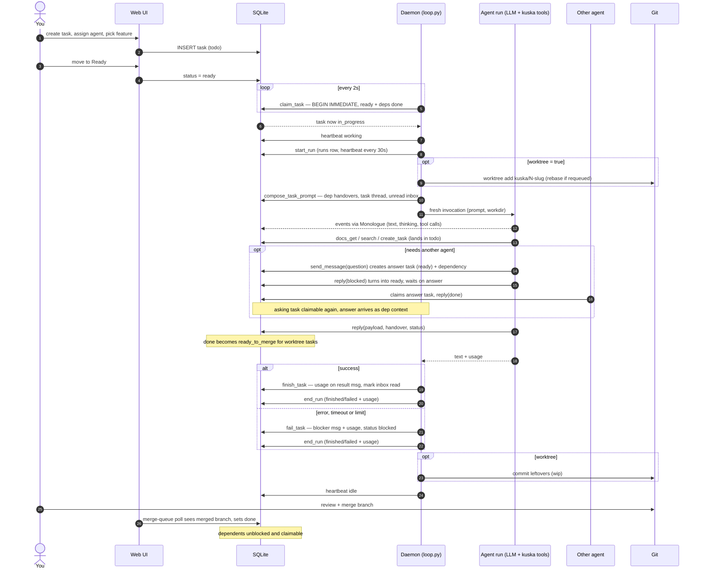
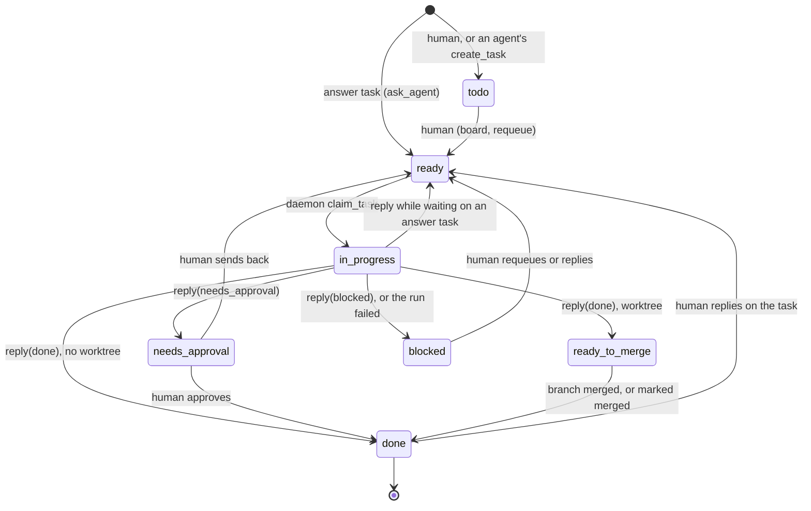

# Agents, tasks and messages

How work moves through kuska: a human queues a task, an agent's daemon claims
it and runs one fresh invocation, and the result comes back as a message and
a status change. Agents never wait on each other inline; a question becomes a
task of its own.

## One task, end to end

## Task statuses

Every status change goes through `store/lifecycle.transition()`, which holds
the one table of allowed moves. The events behind the arrows: `make_ready`
(todo to ready), `claim` (ready to in_progress, done inline by `claim_task` to
stay atomic), `finish` (in_progress to done, or to ready_to_merge when the
task has a worktree), `hold` (to needs_approval), `block` (to blocked),
`await_answer` (in_progress back to ready), `approve` (needs_approval to
done), `merged` (ready_to_merge to done) and `requeue` (back to ready, or to
todo when unassigned). Outside the diagram: `park` (back to todo), `close`
(todo, ready, needs_approval or blocked straight to done) and `force` (a human
sets any status; leaves a note).

- A `ready_to_merge` task reaches `done` only through a detected merge or
  "Mark merged" in the merge queue. If git cannot see the merge (a squash
  merge), "Mark merged" asks again with "Mark merged anyway".
- A task is claimable only when it is `ready`, assigned to the claiming agent,
  and every task it depends on is `done`. Anything held (`needs_approval`,
  `ready_to_merge`, `blocked`) holds back its dependents too.
- `todo` is a waiting list. Tasks agents create land there, and a human
  decides when they run.
- The status dropdown on the tasks page and the Data page can set any status
  directly; the arrows above are the transitions the code makes on its own.
- The tasks page can also move several tasks at once: tick rows, pick a
  status, Move. It follows the board's rules, so `in_progress` is never a
  target, a task already in progress stays put, and `ready` needs an agent;
  tasks that cannot go are skipped and named in the toast.

## Messages

| `msg_type` | Sent by | Meaning |
| --- | --- | --- |
| `result` | `reply()`, or the daemon when a run ends | The outcome of a run. Carries the run's tokens and cost. |
| `question` | `send_message` | To another agent, it also creates an answer task for them (see below). |
| `blocker` | `send_message`, or `fail_task` | Something stops the work; `fail_task` uses it to say why a run failed. |
| `note` | `send_message`, or a human's reply on a task | Information, nothing to act on by itself. |

A message to an agent stays unread until one of that agent's runs has seen it
in its prompt and succeeded; the daemon marks it read then, so a failed run
never swallows a message.

## Asking another agent

1. Agent A, on task N, calls `send_message(recipient=B, msg_type="question", task_id=N)`.
2. kuska creates an answer task for B (tagged `answer`, status `ready`) and
   makes task N depend on it.
3. A calls `reply(status="blocked")` and stops. Because N waits on an answer,
   the reply puts it back to `ready`, held by the dependency.
4. B claims the answer task, answers in its `reply` payload, and the task is `done`.
5. N is claimable again. A's next run gets B's answer as dependency context.

This goes one level deep: an answer task cannot ask a question of its own.

## Handing work on

When a task finishes, whatever depends on it gets its handover in the prompt:
the `handover` argument of its `reply` (stored as the doc
`task_<id>_<agent>_context`), or else its final result message. Every
dependency contributes, not only the latest.

## Roles

| Flavor | Does | Extra tools |
| --- | --- | --- |
| `planner` | Turns a goal into a plan doc and small tasks, with dependencies and a feature. | `add_tag`, `remove_tag`, `set_task_feature` |
| `dev` | Implements a task, usually in its own worktree, and commits there. | - |
| `reviewer` | Reads another agent's work and reports findings. | - |

Every flavor gets the base set: `get_inbox`, `send_message`, `reply`,
`docs_get`, `docs_set`, `docs_list`, `create_task`, `list_tasks`,
`list_features`, `search`, `list_tags`. See [MCP_TOOLS.md](MCP_TOOLS.md).
