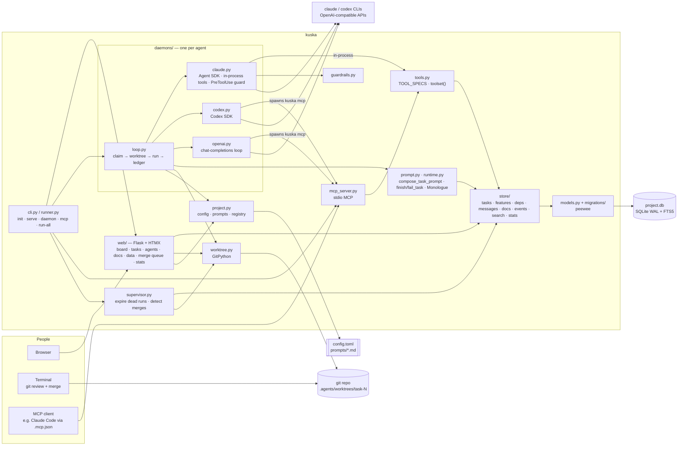
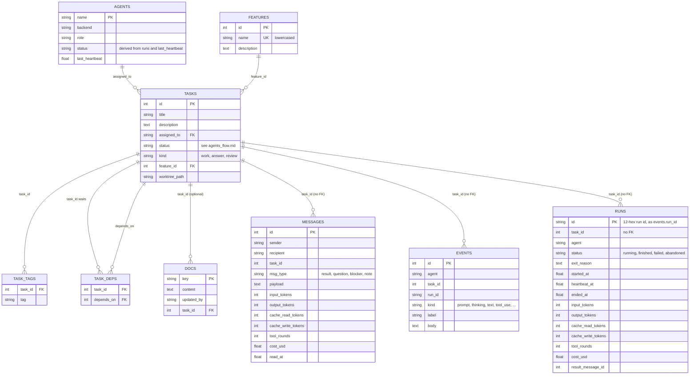

# Architecture

kuska is one Python package run as several processes that share one SQLite
file per project (`.agents/project.db`). The database is the only shared
state: the web UI, the agent daemons and the MCP server never talk to each
other directly, they read and write the same tables.

## Components

| Module | Owns |
| --- | --- |
| `models.py`, `migrations/` | The schema. Models are bound to a database per call, so one process can hold several projects open; the binding is per thread. |
| `store/` | Every read and write of project state, one module per kind of record. Returns plain dicts; nothing outside it touches the ORM (except `tables.py`, the read-only Data browser). |
| `tools.py` | The agent tools, defined once. `toolset(cfg)` picks a caller's set by flavor; an operator (`kuska mcp --operator`) gets all of them, and an unconfigured name is refused. |
| `prompt.py` | What goes into a run: `compose_task_prompt`, `estimate_token_count`. Reads the store only. |
| `runtime.py` | What comes out of a run: `finish_task`, `fail_task`, `RunAborted`, `run_limits`, `estimate_cost`, the `Monologue` event log. |
| `daemons/loop.py` | The loop every backend shares: claim a task, set up its worktree, run it, book the result and cost. |
| `daemons/<backend>.py` | Only the model call: `make_runner()` returns `async run(prompt, workdir, mono) -> (text, usage)`. |
| `worktree.py` | Every git operation: worktree per task, rebase, commit, merge detection. Branch commits and rebases are unsigned; `squash_merge` keeps the user's signing. |
| `guardrails.py` | Regex rules refusing destructive shell commands (Claude's PreToolUse hook). The OS sandbox is the real boundary. |
| `project.py` | `.agents/` layout, `config.toml` (the agent registry), prompt files, the multi-project registry. |
| `web/` | Flask + HTMX UI: `context.py` holds the open project and shared rendering; one module per page area. |

## Processes

| Command | What runs |
| --- | --- |
| `kuska serve` | The web UI (threaded Flask; the project is chosen per browser session and the DB connection is per request). |
| `kuska daemon <agent>` | One agent's loop. One process per agent; run several for parallel work. |
| `kuska mcp --agent <name>` / `kuska mcp --operator` | A stdio MCP server acting as `<name>` (a configured agent), or, with `--operator`, as the human with every tool. Spawned per client: by the codex and openai daemons for every run, and by Claude Code through `.mcp.json`. |
| `kuska supervise` | The supervisor alone: every 15 s it abandons runs whose heartbeat is over 300 s old (blocking their `in_progress` task) and moves `ready_to_merge` tasks whose branch is merged to `done`. `kuska serve` and `kuska run-all` run it as a thread (`serve --no-supervisor` turns it off). |
| `kuska run-all` | Web UI, the supervisor and one daemon per configured agent, as threads of one process. |

A daemon must heartbeat its runs, and a supervisor (in `kuska serve`, `kuska run-all` or `kuska supervise`) must be running, or a crashed daemon's task stays `in_progress` and merges go unnoticed.

SQLite runs in WAL mode with a 10 s busy timeout: many readers, one writer at
a time. `claim_task` takes the write lock up front (`BEGIN IMMEDIATE`), so two
daemons never claim the same task. Migrations and the switch to WAL run under
a file lock, so processes starting together take turns.

## Data model

- **`messages`** is what agents and humans say to each other. Its usage columns are
  legacy: older rows carry a run's cost, newer ones are zero, and only the
  task page and export show them (migration 020 copied them into `runs`).
- **`events`** is each run's monologue (thinking, tool calls, results), keyed
  by `run_id`, the id of the run's `runs` row.
- **`runs`** is one row per agent invocation and the only cost ledger (stats and the
  agents page sum it): a status (`running`, `finished`,
  `failed`, `abandoned`), a heartbeat (a `running` run whose heartbeat goes
  stale has crashed) and its own usage numbers. `task_id` has no FK, so a
  task's runs outlive it. Store functions are in `store/runs.py`; the daemon
  starts a run, heartbeats it and ends it with the backend's usage.
- **`docs`** is shared knowledge. Handover reports are docs keyed
  `task_<id>_<agent>_context` and linked to their task.
- **`features`** groups related tasks; a task has at most one.
- `docs`, `messages`, `tasks` and `events` each have an FTS5 index, kept in
  step by triggers (migration 005).
- The deprecated free-text `tasks.feature` column is still in the database
  for processes running older code; nothing reads it.

## Configuration

`.agents/config.toml` is the agent registry (backend, model, flavor, worktree,
limits, sandbox); `.agents/prompts/<agent>.md` is each agent's system prompt.
`sync_agents_from_config` mirrors the registry into the `agents` table at
startup. A daemon reads its config once, when it starts.

## Safety

- Each run is a fresh invocation in its workdir: the task's worktree, or the
  project checkout when `worktree` is off.
- Shell writes are confined to that workdir by the OS sandbox (bubblewrap or
  Seatbelt for claude, `workspace-write` for codex) unless the agent sets
  `sandbox = "full-access"`.
- `guardrails.py` refuses known-destructive commands before they run (claude
  only); it catches mistakes, not a determined agent.
- Agents cannot overwrite a doc a human wrote, and `reply` works only on the
  caller's own in-progress task.
